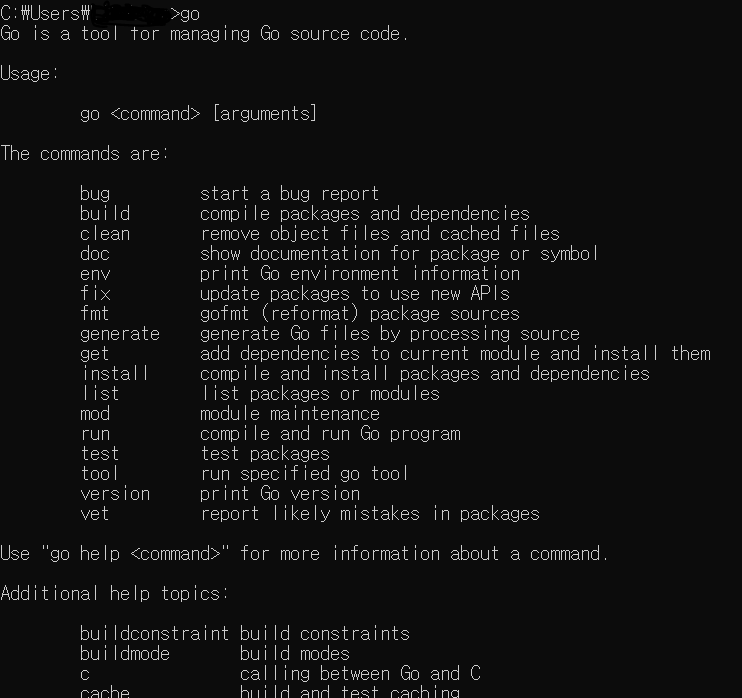
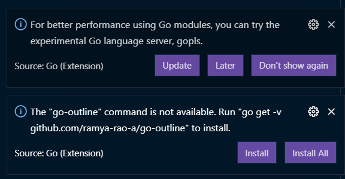

# Go

GO에서 제공하는 데이터 처리 도구를 사용하여 Web Scrapper를 만들면서 GO언어를 익혀보자. 도구를 익히면서 GO의 특징인 `multi-core`와 `병행성(concurrency)`의 매력을 느껴보자

# 00. INTRO

## Software and Installation

- [repl.it](http://repl.it) 사용하기 (컴퓨터에 설치하고 싶지 않다면...)
- 컴퓨터에 설치하기

  - (default) 설치하면 `C:\Go` 경로에 다운로드 된다.
  - 자동으로 환경변수에도 PATH 추가됨
  - 정상적으로 설치가 됐으면 cmd에서 `go`를 입력했을 때 다음과 같은 모습을 볼 수 있다.

  

- Go는 내가 원하는 디렉토리에 프로젝트를 만들어서 사용할 수 없다. Go 코드는 무조건 Go PATH 디렉토리에 저장되어야 한다. Go PATH는 기본적으로 `C:\Go` 경로에 지정되어 있다. (Mac default path: `/usr/local/go`)
- Go는 Node.js나 Python처럼 작동하지 않는다. 예를 들어, Node.js는 package.json을 갖고 우리가 원하는 폴더에 Package들을 다운로드 받을 수 있었다.
- Python이나 Node.js는 모듈 또는 패키지를 다운 받을 수 있는 곳이 한정적이다. (Node.js는 npm에 모든 것이 있다. Python에는 Pypi). 그러나 Go에서는 내가 원하는 곳 어디에서든 코드를 다운로드 받아서 사용할 수 있다.
- Go에서 받아온 코드들을 보기 좋게 정리하는 방법은 도메인별로 분류해서 저장하는 방법을 추천한다. (예: `github.com`, `golang.org`, `google.golang.org`)
- Go modules라는 기능이 있지만 나중에 살펴본다.
- `C:\Go\src\github.com\내Github이름\learngo\main.go` 파일을 만들고, vs code로 열었을 때, 설치 또는 업데이트하라는 익스텐션이 있으면 일단 뭐가 됐든 간에 다 따라하자. 더이상 추가로 뭘 하라는 팝업이 뜨지 않을 때까지...

